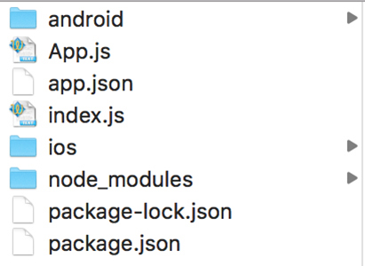
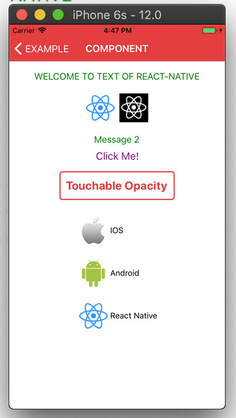
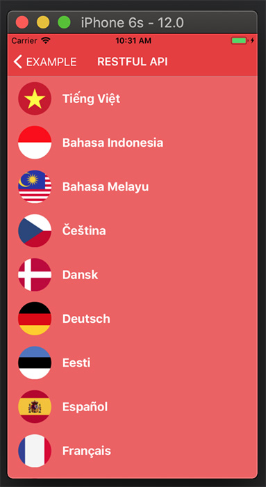

# CODE 101 - React Native

Chào mừng các bạn đến với hướng dẫn học React-Native cho người mới bắt. Sau đây là một số chia sẻ, hướng dẫn của mình cho người mới bắt đầu tìm hiểu về React-Native. Qua đó nhằm giúp các bạn có cách nhìn tổng quát hơn và dễ dàng tìm hiểu vấn đề khi mới chập chững bước chân vào lập trình với React-Native.

P/s: Bài viết chủ yếu dựa trên tài liệu chính thống của React-Native phiên bản 0.56 tại <https://facebook.github.io/react-native/docs/getting-started> kết hợp với sự hiểu biết cá nhân của mình vì vậy nếu có sai sót, anh em cứ góp ý để mình sửa đổi nhé.

# Mục Lục

I. Mục tiêu hướng dẫn<br>
II. Một vài lưu ý<br>
III. Nội dung hướng dẫn

- 1.Hướng dẫn cài đặt môi trường react-native trên hệ điều hành Windows.
- 2.Hướng dẫn cài đặt môi trường react-native trên hệ điều hành MAC OS
- 3.Các IDE khuyên dùng
- 4.Khởi tạo dự án đầu tiên
- 5.Các thành phần cơ bản của dự án
- 6.Component trong React-Native
  - 6.1.Vòng đời của component
  - 6.2.Các thành phần cơ bản của component
  - 6.3.Một số hàm đặc biệt
  - 6.4.Một vài lưu ý nhỏ khi dùng React-Native
- 7.Thiết kế View (Style)
- 8.Kỹ thuật Debug cơ bản
- 9.Các Component thường sử dụng
  - 9.1.View
  - 9.2.Text
  - 9.3.Image
  - 9.4.Button
  - 9.5.TouchableOpacity
  - 9.6.Flatlist
- 10.Prop và cách truyền dữ liệu giữa các View (Screen)
- 11.Cài đặt và sử dụng thư viện
  - 11.1.Cài đặt thư viện
  - 11.2.Link thư viện
  - 11.3.Chỉnh sửa thư viện
- 12.Chuyển đổi giữa các màn hình
- 13.Giao tiếp Client vs Server
  - 13.1.RESTful API.
  - 13.2.Websocket
- 14.Lưu trữ dữ liệu
  - 14.1.Storage:
  - 14.2.Database:
- 15.Đa Ngôn ngữ
- 16.Giao tiếp với Native
- 17.Quy chuẩn tên biến và cấu trúc chương trình
   - 17.1.Tên biến và tên hàm:
   - 17.2.Cấu trúc chương trình:


# I. Mục tiêu hướng dẫn

- Hiểu được các thành phần cơ bản của React-Native.
- Nắm vững được vòng đời của một màn hình, component của React-Native.
- Tùy biến các component theo ý muốn.
- Tìm kiếm, sử dụng và tùy biến thư viện.
- Xây dựng 1 ứng dụng đọc báo như báo mới.

# II. Một vài lưu ý
- Bài viết nhắm tới các bạn đã có cơ bản về javascript nhất là quen với ES6. Nếu bạn chưa biết về javascript vui lòng tìm hiểu javascript cơ bản ít nhất bạn cần nắm vững những kiến thức sau (bạn có thể tự tìm hiểu tại <https://freetuts.net/hoc-javascript/javascript-can-ban>):
  - Biến và toán tử trong javascript
  - Lệnh If...else
  - Lệnh Switch..case
  - Vòng lặp white
  - Vòng lặp for
  - Vòng lặp for...in
  - Viết hàm thực thi các tác vụ cơ bản
  - Mảng: (duyệt mảng lấy các phần tử)

- Nếu biết về css thì đó cũng là một điểm lợi thế. Bạn có thể tìm hiểu thêm tại đây <https://freetuts.net/css-la-gi-hoc-css-nhu-the-nao-327.html>
- Hiện tại hệ điều hành Windows chỉ build được ứng dụng Android.
- Hệ điều hành IOS có thể build được cả Android và IOS.
- Phiên bản IOS thấp nhất mà react-native có thể hỗ trợ là IOS 8.0
- Phiên bản Android thấp nhất mà react-native có thể hỗ trợ là Android 4.1 (API 16)
- Các hướng dẫn dưới đây ngoại trừ phần cài đặt, đều là hướng dẫn để xây dựng ứng dụng trên IOS. Một số chức năng có thể IOS hỗ trợ nhưng Android không hỗ trợ và ngược lại, nên nếu có lỗi các bạn có thể bình luận tại đây hoặc tìm kiếm google để nâng cao khả năng giải quyết vấn đề nhé.
- Để chạy các code mẫu, sau khi tải về vui lòng vào thư mục và chạy dòng lệnh ```npm install``` để tải toàn bộ thư viện cần sử dụng. Và chạy ```react-native run-ios``` để chạy ứng dụng trên IOS. ```react-native run-android``` để chạy ứng dụng trên hệ điều hành Android.

**Khuyến nghị**: Sau những lần tìm hiểu và phát triển ứng dụng thì mình khuyến cáo không nên sử dụng Expo (framework của react) để phát triển ứng dụng đơn giản. Bởi vì dự án của bạn sẽ nặng lên, bạn rất khó quản lý permission và các thư viện đi kèm.


# III. NỘI DUNG HƯỚNG DẪN
## 1. Hướng dẫn cài đặt môi trường react-native trên hệ điều hành Windows.

- **Bước 1**: Cài đặt Chocolatey từ <https://chocolatey.org> (Chocolatey là trình quản lý các gói thư viện của Windows)
- **Bước 2**: Cài đặt Nodejs Java và Python 2 thông qua Chocolatey sử dụng dòng lệnh sau (dùng cmd để chạy lệnh này):<br>
```choco install -y nodejs.install python2 jdk8```

- **Bước 3**: Cài đặt Android studio
- **Bước 4**: Cài đặt SDK: Nên cài SDK Platform 23 vì mặc định react-native hiện tại sử dụng Android SDK Platform 23 để build ứng dụng 


Lưu ý: Trên hệ điều hành windows chỉ có thể build ứng dụng trên Android.
## 2. Hướng dẫn cài đặt môi trường react-native trên hệ điều hành MAC OS

- **Bước 1**: Cài đặt Brew: Brew là trình quản lý các gói thứ viện, MACOS không tích hợp sẵn và bạn phải sử dụng terminal để cài đặt brew bằng cách chạy dòng lệnh sau. <br>
```{{/usr/bin/ruby -e "$(curl –fsSL https://raw.githubusercontent.com/ Homebrew/install/master/install)"}}```

- **Bước 2**: Cài đặt Nodejs:<br>
```brew install node```

- **Bước 3**: Cài đặt Watchman:<br>
```brew install watchman```

- **Bước 4**: Cài đặt react-native:<br>
```npm install -g react-native-cli```

- **Bước 5**: Cài đặt Xcode: truy cập App Store trên MACOS để cài đặt Xcode.
- **Bước 6** (option): Nếu bạn xây dựng ứng dụng android sử dụng hệ điều hành MACOS thì bạn cần cài đặt thêm các gói như JDK, Android Studio, Android SDK. (xem thêm phần cài đặt cho Windonws để hiểu rõ hơn.)

## 3. Các IDE khuyên dùng

- Code: Hiện tại mình sử dụng Visual Studio Code các bạn có thể download về và cài đặt tại <https://code.visualstudio.com/> <br> Các bạn cũng có thể sử dụng bất kỳ IDE nào các bạn thích như Sublime Text Atom, Vim Editer...
- Build ứng dụng: 
 - IOS: sử dụng Xcode (search trên store apple nhé)
 - Android: sử dụng Android studio <https://developer.android.com/studio/>

P/s: Nếu sử dụng MAC thì nên dùng Xcode để chạy ứng dụng. Bởi vì một số lý do như: Run các lần sau nhanh hơn, xem log debug mà không cần bật chức năng Debug JS Remotely và quan trọng là làm quen với một số chức năng của Xcode để lúc xảy ra lỗi fix lỗi nhanh hơn. <br> Với Android thì có một vài trở ngại khi dùng Android studio như việc run mà không dùng code react-native mới nhất, chức năng host reloading cũng khó hoạt động.

## 4. Khởi tạo dự án đầu tiên
- **Bước 1**: Khởi tạo dự án: mở Terminal (cmd) sau đó gõ lệnh này vào  (cd vào thư mục bạn muốn tạo dự án trước)<br>
```react-native init ProjectName```

- **Bước 2**: Truy cập vào dự án vừa tạo.<br>
```cd ProjectName```

- **Bước 3**: Chạy ứng dụng trên hệ điều hành:<br>
IOS: ```	react-native run-ios``` <br>Android: ```react-native run-android```

Khi chạy lệnh này hệ điều hành sẽ tạo một server local để build code react của bạn. Kèm theo đó là chạy các lệnh để build ứng dụng.<br>Bạn cũng có thể mở file /ios/ProjectName.xcodeproj bằng Xcode để khởi chạy ứng dụng, hoặc mở nguyên thư mục android bằng Android studio để khởi chạy ứng dụng.

- **Hiển thị Menu điều khiển**:
  - Command + D (hoặc lắc điện thoại IOS) để hiển thị menu điều khiển khi run debug ứng dụng trên MacOS.
  - ctrl + D hoặc phím menu để hiển thị menu điều khiển khi run debug ứng dụng trên Windown.
  - Command + R để reload lại source code máy ảo IOS
  - R + R để reload lại source code máy ảo Android.

- **Một vài lệnh vui vui để sửa lỗi**  (Bật terminal or cmd trong dự án vừa khởi tạo)

  - Không khởi tạo server để build khi run debug trên android thì chạy
 ```react-native start```
 
  - Khi run Android mà không sử dụng code react-native mới nhất thì chạy dòng này (Build toàn bộ source của bạn thành 1 file và đặt nó vào trong assets, tạo các resource android tương ứng mà bạn sử dụng).
```
react-native bundle --platform android --dev false --entry-file index.js --bundle-output android/app/src/main/assets/index.android.bundle --assets-dest android/app/src/main/res
```
   - Khi general APK mà bị lỗi double resource thì xóa thư mục drawable trong android/app/src/main/res thì sẽ build được.
 
   - Khi run app ios bị lỗi "Build input file cannot be found: '../Example/node_modules/react-native/third-party/double-conversion-1.1.6/src/strtod.cc'" thì chạy 2 dòng lệnh sau:
 
 ```
cd node_modules/react-native/scripts && ./ios-install-third-party.sh && cd ../../../
cd node_modules/react-native/third-party/glog-0.3.5/ && ../../scripts/ios-configure-glog.sh && cd ../../../../
```
Chú ý version phiên bản glog (0.3.5) mà bạn đang sử dụng.

## 5. Các thành phần cơ bản của dự án
Cấu trúc thư mục mà bạn nhìn thấy có thể sẽ như dưới đây (tùy version react-native hiện tại của bạn). Hình dưới đây không bao gồm một vài file bị ẩn thuộc cấu hình của react-native<br>


- **Thư mục Android**: chứa toàn bộ source build ứng dụng Android. Chúng ta có thể mở thư mục Android bằng Android studio và chạy ứng dụng thay vì sử dụng dòng lệnh ```react-native run-android``` nhưng có thể ứng dụng sẽ không build mã javascript được và sẽ xuất hiện màn hình trắng trên điện thoại android.

- **Thư mục IOS**: chứa toàn bộ source build ứng dụng IOS. Chúng ta có thể mở file ProjectName.xcodeproj bằng Xcode để run ứng dụng IOS thay vì sử dụng dòng lệnh ```react-native run-ios```. Lần đầu có thể chạy hơi lâu nhưng những lần tiếp theo sẽ nhanh hơn việc build bằng dòng lệnh.

- **Thư mục node_modules**: chứa toàn bộ các package (thư viện) cần để chạy một ứng dụng react-native.

- **File package.js**: file quản lý các package nodejs đi kèm với dự án. Nếu bạn tải các dự án demo về cần dử dụng dòng lệnh ```npm install``` để tải toàn bộ thư viện yêu cầu của dự án về.

- **File package-lock.js** file được general sau khi chạy cài đặt ```npm install```

- **File index.js**: file đầu tiên được binding khi chạy ứng dụng. File này sẽ đăng ký một component, component này sẽ được load lên đầu tiên khi chạy, mặc định ứng dụng sẽ đăng ký component trong App.js

- **File app.json**: file config tên ứng dụng và tên hiển thị.

- **File App.js** là một component mặc định có sử dụng một số Component khác như Text, View...


## 6. Component trong React-Native
Component là một thành phần cơ bản trong ứng dụng react-native. Mọi view, screen đều được kế thừa từ lớp component này.

### 6.1. Vòng đời của component

<br><em>(Nguồn:: internet)</em>

**Các hàm được gọi trong vòng đời của Component**

- **constructor(props)** - Hàm khởi tạo component. Trong hàm này chúng ta thường dùng để khởi tạo state, binding các hàm con của component.<br> Lưu ý: Không được thay đổi state bằng phương thức ```this.setState()``` trong hàm này.

- **componentWillMount()** - Hàm này sẽ bị loại bỏ ở phiên bản mới.

- **render()** - Đây là hàm bắt buộc có trong component. Sau khi khởi tạo hàm này được gọi để trả về các thành phần hiển thị lên màn hình.<br>Hàm này sẽ được tự động gọi lại khi state hoặc props của nó thay đổi. Chỉ những component có sử dụng state hoặc props thì mới được gọi lại để render lại.<br><br>**Lưu ý:**
  * Trong hàm này cũng không được sử dụng phương thức ```this.setState()```<br> 
  * Trong hàm này không nên chạy xử lý dữ liệu nhiều để không bị lag khi render (nên xử lý dữ liệu trong componentDidMount hoặc constructor).
  
- **componentDidMount()** - Hàm này sẽ được gọi ngay sau khi hàm **render()** lần đầu tiên được gọi. Thông thường trong hàm này ta có thể lấy dữ liệu từ server hoặc client để render dữ liệu ra. Khi chạy đến đây thì các phần từ đã được sinh ra rồi, ta có thể tương tác với các thành phần UI.

- **componentWillReceiveProps(nextProps)** - Hàm này được gọi khi props của component được khởi tạo thay đổi.

- **shouldComponentUpdate(nextProps, nextState)** - Hàm này được gọi trước render() khi cập nhật dữ liệu. Hàm này trả về giá trị true hoặc false. Nếu false thì không gọi lại hàm render mặc định nó trả về true.

- **componentWillUpdate(nextProps, nextState)** - Hàm này được gọi ngay sau khi hàm shouldComponentUpdate() trả về true. Trong hàm này cũng không được set lại state.

- **componentDidUpdate(prevProps, prevState)** - Hàm này được gọi ngay sau hàm render() từ lần thứ 2 trở đi.

- **componentWillUnmount()** - Hàm này được gọi khi component này bị loại bỏ. Chúng ta nên thực hiện các thao tác dọn dẹp, hủy timer hoặc các tiến trình đang xử lý.


### 6.2. Các thành phần cơ bản của component
Sau đây là chương trình mẫu cơ bản để ta hiểu được các thành phần của một Component

```javascript
import React, { Component } from 'react';
import { Text, View } from 'react-native';

export default class App extends Component {

    constructor(props) {
        super(props);
        this.state = {
            message: "Welcome to Code 101 - React-native"
        }
    }

    render() {
        return (
            <View>
                <Text>{this.state.message}</Text>
            </View>
        );
    }
}
```
- **State** - là biến điều khiển trạng thái nội bộ của 1 component. State có thể thay đổi bằng cách gọi hàm this.setState({...}). Mỗi lần thay đổi state hàm render sẽ được gọi lại ngay sau đó (hàm render chỉ thay đổi những thành phần có liên quan đến những giá trị trong state bị thay đổi).<br> Chúng ta nên bỏ các biến có liên quan đến UI vào trong state này, để khi state thay đổi, UI màn hình sẽ được vẽ lại và thay đổi theo.
<br>**Lưu ý:** Không được thay đổi state trực tiếp bằng cách gọi this.state = {...} nếu sử dụng thay đổi state trực tiếp toàn bộ component này sẽ không còn hoạt động đúng như mong muốn nữa.

- **Props** - là các thuộc tính được thằng sử dụng truyền vào. Đây là các thông số được truyền vào để tùy chỉnh theo ý muốn của người xây dựng Component. Khác với state chúng ta không được thay đổi props ở trong chính bản thân của nó. Chúng ta chỉ nên đọc các thuộc tính được truyền vào để sử dụng mà thôi.<br> Ví dụ sử dụng props: cũng là ví dụ trên nhưng chúng ta custom một số thứ để bạn có thể hiểu rõ hơn về props.

```javascript
import React, { Component } from 'react';
import { Text, View } from 'react-native';

class CustomText extends Component {
    constructor(props) {
        super(props);
    }

    render() {
        return (
            <Text>{this.props.message}</Text>   /*Sử dụng props được truyền từ ngoài vào.*/
        );
    }
}

export default class App extends Component {
    constructor(props) {
        super(props);
        this.state = {
            message: "Welcome to Code 101 - React-native"
        }
    }

    render() {
        return (
            <CustomText message={this.state.message} /> /*truyền 1 props vào cho thằng con sử dụng.*/
        );
    }
}
```

### 6.3. Một số hàm đặc biệt

- **Hàm this.setState()** - Hàm dùng để thay đổi state của component. Đây là phương thức chính để cập nhật giao diện người dùng. Khi hàm này thực thi xong thì hàm **render()** sẽ được tự động gọi lại. **Những giá trị nào của state thay đổi thì chỉ những thành phần có sử dụng biến state tương ứng đó được gọi để vẽ lại UI**.
<br>Lưu ý: hàm này chạy bất đồng bộ nên chúng ta không nên đọc giá trị sau khi gọi hàm này. <br>Cách sử dụng: 

```javascript
this.setState({
	message: "Chào mừng",
	key: "Value",
})
console.log(this.state.message) //không nên
// không sử dụng this.state ngay sau khi vừa set xong
// biến truyền vào cho hàm setState là một đối tượng có dạng key: value.

```

Có thể sử dụng callback để check dữ liệu hoặc xử lý một số tác vụ sau khi thay đổi trạng thái

```javascript
this.setState({
	message: "Chào mừng"
}, ()=>{
	console.log(this.state.message)   // kết quả: Chào mừng
})

```


- **Hàm forceUpdate()** - Mặc định hàm render() sẽ được gọi khi props hoặc state thay đổi. Nhưng nếu một vài thành phần UI sử dụng một số dữ liệu khác state hoặc prop muốn thay đổi, thì chúng ta cần thông báo cho React biết để vẽ lại toàn bộ bằng cách gọi hàm forceUpdate().

### 6.4. Một vài lưu ý nhỏ khi dùng React-Native
- Dữ liệu cần in ra màn hình và cần thay đổi lại UI khi nó thay đổi thì đặt vào state.
- Dữ liệu không cần thay đổi UI khi nó thay đổi thì có thể dùng ```this.xxx``` như vậy biến này có thể thực hiện thao tác = (gán) và sử dụng trực tiếp như các biến thông thường.
- Dữ liệu trong prop thì không nên thay đổi.
- Trong **state** chỉ nên chứa dữ liệu, không nên chứa các **View / Component** vào trong state. Làm như vậy có thể gây double dữ liệu và việc quản lý UI trở nên phức tạp hơn và khó tùy biến sau này.

## 7. Thiết kế View (Style)

Sau đây là một đoạn code Demo về Style của ứng dụng React-Native. Code có sẵn trong Example (Example/app/modules/screens/Home/StyleDemo)

```javascript
export class StyleDemo extends React.Component {
    render() {
        return (
            <View>
                <Text style={styles.red}>just red</Text>
                <Text style={styles.bigblue}>just bigblue</Text>
                <Text style={[styles.bigblue, styles.red]}>bigblue, then red</Text>
                <Text style={[styles.red, styles.bigblue]}>red, then bigblue</Text>
            </View>
        );
    }
}

const styles = StyleSheet.create({
    bigblue: {
        color: 'blue',
        fontWeight: 'bold',
        fontSize: 30,
    },
    red: {
        color: 'red',
    },
});

```

Giống như một ứng dụng web cơ bản, React-Native sử dụng một số thẻ css để vẽ những gì bạn muốn. Nếu bạn là lập trình web quen thuộc với css thì việc thiết kế này khá đơn giản. Để trau dồi những khả năng này chỉ có cách là làm nhiều bạn sẽ tìm hiểu những style bạn muốn và sẽ làm ứng dụng của bạn đẹp hơn.

Ở ví dụ trên bạn có thể thay đổi các thuộc tính của style rồi reload lại để thấy sự thay đổi nhé.

Trong ví dụ thư mục Home tôi đã chia phần Style qua một file khác để dễ quản lý (Từ các ví dụ sau trở đi, tôi sẽ chia phần style này sang 1 file khác để dễ quản lý). Bạn có thể vào đó, thử thay đổi, xóa sửa để biết được thuộc tính nào dùng để làm gì nhé. Làm nhiều phần này thì sẽ có kinh nghiệm thiết kế đẹp thôi. 

Một vài lưu ý:

- Bạn nên biết thuộc tính nào dùng để làm gì, sử dụng tối ưu để hiệu quả nhất (Có thể copy code của ai đó nhưng nên hiểu dòng style nào làm việc gì).
- Không nên quá rườm rà code ngắn nhưng đạt được yêu cầu là tốt nhất.


## 8. Kỹ thuật Debug cơ bản

Xây dựng ứng dụng React-Native khác với ứng dụng native là bạn không thể đặt break point rồi chạy và chờ chương trình nhảy vào vị trí mà bạn đợi và xem trạng thái hay biến lúc đó bằng bao nhiêu đang như thế nào. Thay vì vậy chương trình React-Native cho phép bạn in giá trị tại thời điểm đó và xuất ra màn hình console.<br> Sử dụng lệnh 
```console.log(variable)``` để in giá trị của biến bất kì (xem ví dụ phía trên để biết việc in giá trị của biến message trong state)

Xcode và Android studio mặc định khi run debug sẽ xuất các log này ra trong phần All Output (Xcode), Logcat (Android Studio).

Bên cạnh đó bạn có thể sử dụng chức năng Debug JS Remotely (xem phần hiển thị menu điều khiển trong mục 4) để thấy các log này trong phần console của trình duyệt web.

Ngoài ra bạn có thể sử dụng terminal (cmd) để xem log IOS hoặc Android bằng cách gõ lệnh:

```
react-native log-ios
//or
react-native log-android

```

## 9. Các Component thường sử dụng
Dưới đây là code demo những component cơ bản thường sử dụng. Bạn có thể code lại, copy hoặc chạy demo từ example (demo có sử dụng hình ảnh nên bạn phải copy hình ảnh trong example - Example/app/assets/images).

```javascript
import React from 'react';
import { Image, View, Text, Button, TouchableOpacity, FlatList, StyleSheet } from 'react-native';
import { Colors } from '../../../configs/style';

export class Components extends React.Component {
	//Header ứng dụng (tùy chọn)
    static navigationOptions = ({ navigation }) => {
        return {
            title: "COMPONENT",
            headerStyle: {
                backgroundColor: Colors.primary
            },
            headerTintColor: Colors.white,
            headerTitleStyle: {
                alignSelf: 'center'
            }
        };
    };

    constructor(props) {
        super(props);
        this.state = {
            message: "Message 2",
            listData: [
                {
                    image: require('../../../assets/images/ios.png'),
                    title: "IOS"
                },
                {
                    image: require('../../../assets/images/android.png'),
                    title: "Android"
                },
                {
                    image: require('../../../assets/images/react-native.png'),
                    title: "React Native"
                }
            ]
        }
        this.clickButton = 0;
        this.clickTouchAbleOpecity = 0;
    }
    
    onPressButtonDemo() {
        this.clickButton++;
        this.setState({
            message: "Clicked Button: " + this.clickButton
        })
    }

    onPressTouchableOpacityDemo() {
        this.clickTouchAbleOpecity++;
        this.setState({
            message: "Clicked TouchableOpacity: " + this.clickTouchAbleOpecity
        })
    }

    render() {
        return (
            <View style={Styles.container}>
                {/* Hiển thị Một message lên màn hình */}
                <Text style={Styles.textMessage}>WELCOME TO TEXT OF REACT-NATIVE</Text>
                <View style={Styles.containImage}>
                    {/* Hiển thị ảnh từ local resource */}
                    <Image
                        style={Styles.imgLogo}  /* Style của ảnh */
                        resizeMode={'contain'}  /* chế độ hiển thị (center, contain, cover, repeat, stretch )  của ảnh */
                        source={require('../../../assets/images/react-native.png')}
                    />

                    {/* Hiển thị ảnh từ web/server */}
                    <Image
                        style={Styles.imgLogo}
                        resizeMode={'contain'}
                        source={{ uri: 'https://facebook.github.io/react-native/docs/assets/favicon.png' }}
                    />
                </View>
                {/* In một giá trị của state lên màn hình */}
                <Text style={Styles.textMessage}>{this.state.message}</Text>

                {/* Sử dụng Button với chức năng press vào nút */}
                <Button
                    onPress={() => this.onPressButtonDemo()}
                    title="Click Me!"
                    color="#841584"
                />

                {/* Sử dụng TouchableOpacity với chức năng press giống như button */}
                <TouchableOpacity
                    style={Styles.btnStyle}
                    onPress={() => this.onPressTouchableOpacityDemo()}>
                    <Text style={Styles.textAction}>Touchable Opacity</Text>
                </TouchableOpacity>


                {/* Sử dụng FlatList để hiển thị ra một danh sách */}
                <FlatList
                    data={this.state.listData}
                    renderItem={({ item }) => this.renderItem(item)}
                    keyExtractor={(item, index) => index.toString()}
                />
            </View>
        );
    }

    /* Hiển thị chi tiết 1 item như thế nào */
    renderItem(item) {
        return (
            <View style={Styles.containerItem}>
                <Image
                    style={Styles.imgLogo} 
                    resizeMode={'contain'}  
                    source={item.image}
                />
                <Text>{item.title}</Text>
            </View>
        )
    }
}
//Trong example mình tách phần Styles này qua file khác cho dễ đọc
const Styles = StyleSheet.create({
    container: {
        flex: 1,
        flexDirection: 'column',
        alignItems: 'center',
        backgroundColor: Colors.white,
    },
    containImage: {
        marginTop: 16,
        flexDirection: 'row',
        justifyContent: 'center'
    },
    textMessage: {
        marginTop: 16,
        color: 'green',
        fontSize: 16,
    },
    imgLogo: {
        width: 50,
        height: 50,
        margin: 4
    },
    btnStyle: {
        height: 50,
        width: 200,
        borderColor: Colors.primary,
        borderRadius: 5,
        borderWidth: 2,
        justifyContent: "center",
        alignItems: 'center',
        margin: 8
    },
    textAction: {
        color: Colors.primary,
        fontSize: 20,
        fontWeight: 'bold'
    },
    containerItem: {
        marginTop: 16,
        flexDirection: 'row',
        alignItems: 'center'
    }
});

```

Sau khi chạy Demo ta được UI như sau (run example thì click vào component)



### 9.1. View 
Là một component cũng thường xuyên được sử dụng. Thường được sử dụng với mục đích chia các view con theo hàng dọc hoặc hàng ngang dựa vào thuộc tính flexDirection trong style là 'column/row' (dọc / ngang), hoặc sử dụng để chứa nhiều view con hoặc khi cần in ra màn hình một view không hiển thị gì hết ví dụ như trong cấu trúc toán tử:

```
{
	(Điều kiện) ?  <Text> Text Message <Text> : <View/>
}
```
flex: 1 ở style sẽ giúp kéo view rộng hết khung chứa có thể.

### 9.2. Text
Dùng để hiển thị 1 message lên màn hình. Có thể sử dụng text cố định hoặc in nội dung của một biến lên màn hình

```
<Text>Message Here<Text>
<Text>{variable_here}<Text>
```

### 9.3. Image
Dùng để hiển thị hình ảnh lên màn hình. Có 3 cách hiển thị:

- Hiển thị ảnh Local:

```
<Image
	source={require('/react-native/img/favicon.png')}
/>
```

- Hiển thị ảnh từ url:

```
<Image
	style={{width: 50, height: 50}}
	source={{uri: 'https://facebook.github.io/react-native/docs/assets/favicon.png'}}
/>
```

- Hiển thị ảnh base 64:

```javascript
<Image
	style={{width: 66, height: 58}}
	source={{uri: 'data:image/png;base64,iVBORw0KGgoAAAANSUhEUgAAADMAAAAzCAYAAAA6oTAqAAAAEXRFWHRTb2Z0d2FyZQBwbmdjcnVzaEB1SfMAAABQSURBVGje7dSxCQBACARB+2/ab8BEeQNhFi6WSYzYLYudDQYGBgYGBgYGBgYGBgYGBgZmcvDqYGBgmhivGQYGBgYGBgYGBgYGBgYGBgbmQw+P/eMrC5UTVAAAAABJRU5ErkJggg=='}}
/>
```


Resize Mode quen thuộc:

- cover: (mặc định) Hình ảnh sẽ giữ nguyên tỷ lệ. Ảnh sẽ lớn hơn hoặc bằng khung chứa.
- contain: Hình ảnh vẫn giữ nguyên tỷ lệ. Ảnh sẽ nhỏ hơn hoặc bằng khung chứa
- center: Căn giữa hình ảnh theo 2 chiều. Lấy phần ở giữa, gần giống với cover.

- repeat: Lặp lại hình ảnh để che hết phần kích thước ô chứa.
- stretch: Thay đổi tỷ lệ hình ảnh để kéo dãn bằng với ô chứa.


### 9.4. Button
Cách sử dụng một Button


```javascript

onPressButtonDemo(){
	console.log("Click Button")
}

....
<Button
 	onPress={() => this.onPressButtonDemo()}
	title="Click Me!"
	color="#841584"
/>

```

Thông thường mình ít khi sử dụng Button vì lý do custom style nó không hoạt động đúng với cả Android và IOS vì vậy nên mình thường sử dụng TouchableOpacity hơn.
Nhưng lưu ý cách sử dụng sự kiện onPress ```onPress={() => this.onPressButtonDemo()}``` Vui lòng viết theo cấu trúc này để giảm thiểu lỗi hoặc là phải binding hàm trong contrucstor trước lúc sử dụng. Sự kiện onPress chỉ có một số component hỗ trợ, Text thì không hỗ trợ nên nếu muốn sử dụng onPress cho Text thì đọc phần TouchableOpacity phía dưới nhé.


### 9.5. TouchableOpacity
Thông thường mình thay thế việc sử dụng Button bằng TouchableOpacity để việc định dạng style giống nhau cho cả android và ios, TouchableOpacity có thể chứa bất kỳ view con nào, và nhớ lưu ý cách dùng sự kiện onPress giống như Button nhé.

```javascript
 <TouchableOpacity
 	style={Styles.btnStyle}
 	onPress={() => this.onPressTouchableOpacityDemo()}>
 		<Text style={Styles.textAction}>Click Me</Text>
</TouchableOpacity>
```

### 9.6. Flatlist
Đây là Component thường được sử dụng để hiển thị 1 danh sách lên màn hình. <br>Cách dùng:

```javascript
<FlatList
	data={this.state.listData}
	renderItem={({ item }) => this.renderItem(item)}
	keyExtractor={(item, index) => index.toString()}
/>

/* Hiển thị chi tiết 1 item như thế nào */
renderItem(item) {
    return (
        <View style={Styles.containerItem}>
            <Image
                style={Styles.imgLogo} 
                resizeMode={'contain'}  
                source={item.image}
            />
            <Text>{item.title}</Text>
        </View>
    )
}
```

Một vài lưu ý khi sử dụng Flatlist:

- Khi một thành phần data (ví dụ data[0] = ...) của bạn thay đổi thường thì không vẽ lại UI cho nên bạn sẽ cần thêm một thuộc tính là ```extraData={this.state}```. Lúc này mỗi lần state thay đổi thì danh sách lại được vẽ lại.

- Có thể sử dụng Flatlist để làm như GridView trong android dựa vào thuộc tính numColumns={colum} (colum là số cột). Nhưng bạn sẽ cần phải tính toán width, height của mỗi colum để hiển thị đẹp nhất (Không có sẵn như fill_parent trong android).


Các component ở trên mình chỉ mang tính chất giới thiệu để các bạn tìm hiểu. Để hiểu rõ hơn cũng như tìm hiểu thêm về các thuộc tính của mỗi component thì vui lòng đọc riêng tài liệu của các Component nhé.
Mỗi component sẽ có nhiều thuộc tính khác để hỗ trợ bạn làm UI tốt và mượt nhất có thể.

## 10. Prop và cách truyền dữ liệu giữa các View (Screen)

Tạo file App.js như sau

```javascript

import React from 'react';
import { View, Text, FlatList, StyleSheet } from 'react-native';
import { Colors } from '../../../configs/style';
import { ViewItem } from './ViewItem'

export class App extends React.Component {
    //Header ứng dụng (tùy chọn)
    static navigationOptions = ({ navigation }) => {
        return {
            title: "PROPS",
            headerStyle: {
                backgroundColor: Colors.primary
            },
            headerTintColor: Colors.white,
            headerTitleStyle: {
                alignSelf: 'center'
            }
        };
    };

    constructor(props) {
        super(props);
        this.state = {
            message: "",
            listData: [
                {
                    image: require('../../../assets/images/ios.png'),
                    title: "IOS"
                },
                {
                    image: require('../../../assets/images/android.png'),
                    title: "Android"
                },
                {
                    image: require('../../../assets/images/react-native.png'),
                    title: "React Native"
                }
            ]
        }
    }

    // onPressItem
    onPressItem(item, index) {
        this.setState({
            message: "Click item: " + index + " - title: " + item.title
        })
    }

    render() {
        return (
            <View style={Styles.container}>
                <Text style={Styles.textMessage}>{this.state.message}</Text>
                <FlatList
                    style={Styles.containList}
                    data={this.state.listData}
                    renderItem={({ item, index }) => this.renderItem(item, index)}
                    keyExtractor={(item, index) => index.toString()}
                />
            </View>
        );
    }

    /* Hiển thị chi tiết 1 item như thế nào */
    renderItem(item, index) {
        return (
            <ViewItem
                data={item} //Truyền item này qua ViewItem như một prop
                onPressItem={(itemPress) => { this.onPressItem(itemPress, index) }}    // truyền một hàm qua để bắt sự kiện click item
            />
        )
    }
}

const Styles = StyleSheet.create({
    container: {
        flex: 1,
        flexDirection: 'column',
        alignItems: 'center',
        backgroundColor: Colors.white,
    },
    textMessage: {
        marginTop: 16,
        color: 'green',
        fontSize: 16,
    },
    containList:{
        width: '100%',
    }
});


```

và 1 file ViewItem.js nằm cùng thư mục

```javascript
import React from 'react';
import { Image, View, Text, TouchableOpacity, StyleSheet } from 'react-native';
import { Colors } from '../../../configs/style';

export class ViewItem extends React.Component {

    constructor(props) {
        super(props);
        this.state = {
            color: Colors.white
        }
    }


    onPressItem() {
        //Bạn có thể xử lý sự kiện ở đây nếu cần, ví dụ như như đổi màu item
        let newColor = Colors.white;
        if (this.state.color == Colors.white) {
            newColor = Colors.primary
        }
        this.setState({
            color: newColor
        })

        //Hoặc chuyển việc xử lý đó ra phía ngoài thông qua hàm được truyền vào.
        //Có thể truyền dữ liệu ra ngoài để hàm phía ngoài xử lý
        this.props.onPressItem(this.props.data)
    }

    render() {
        //in props được truyền qua để kiểm tra
        console.log(this.props.data)
        //render ra màn hình item được truyền vào thông qua props
        return (
            <TouchableOpacity style={[Styles.containerItem, { backgroundColor: this.state.color }]} onPress={() => this.onPressItem()}>
                <Image
                    style={Styles.imgLogo}
                    resizeMode={'contain'}
                    source={this.props.data.image}  //sử dụng prop được truyền qua
                />
                <Text>{this.props.data.title}</Text>
            </TouchableOpacity>
        )
    }
}

const Styles = StyleSheet.create({
    imgLogo: {
        width: 50,
        height: 50,
        margin: 4
    },
    containerItem: {
        marginLeft: 16,
        marginRight: 16,
        marginTop: 16,
        flexDirection: 'row',
        alignItems: 'center'
    }
});

```

Trong Example mình đã gộp style lại và đưa nó ra 1 file riêng là styles.js để dễ quản lý (demo trên có sử dụng hình ảnh nên bạn phải copy hình ảnh trong example - Example/app/assets/images).

Ở ví dụ trên ta demo việc truyền dữ liệu giữa 2 component thông qua props

Bên gửi qua (ViewItem đóng vai trò là 1 component được tùy biến)

```javascript
<ViewItem
	data={item} //Truyền item này qua ViewItem như một prop
	onPressItem={(itemPress) => { this.onPressItem(itemPress, index) }}    // truyền một hàm qua để bắt sự kiện click item
/>
```

Bên nhận dữ liệu có thể sử dụng dữ liệu được truyền qua thông qua props. (Kiểu nó ném mấy cái dữ liệu qua thì bên nhận này truy xuất thông qua props) 

```javascript
...
render() {
    //in props được truyền qua để kiểm tra
    console.log(this.props.data)
    //render ra màn hình item được truyền vào thông qua props
    return (
        <TouchableOpacity style={[Styles.containerItem, { backgroundColor: this.state.color }]} onPress={() => this.onPressItem()}>
            <Image
                style={Styles.imgLogo}
                resizeMode={'contain'}
                source={this.props.data.image}  //sử dụng prop được truyền qua
            />
            <Text>{this.props.data.title}</Text>
        </TouchableOpacity>
    )
}
```

Việc truyền dữ liệu ngược lại cũng được thể hiện trong ví dụ thông qua việc xử lý sự kiện onPressItem()

```javascript
onPressItem() {
    //Bạn có thể xử lý sự kiện ở đây nếu cần, ví dụ như như đổi màu item
    let newColor = Colors.white;
    if (this.state.color == Colors.white) {
        newColor = Colors.primary
    }
    this.setState({
        color: newColor
    })

    //Hoặc chuyển việc xử lý đó ra phía ngoài thông qua hàm được truyền vào.
    //Có thể truyền dữ liệu ra ngoài để hàm phía ngoài xử lý
    this.props.onPressItem(this.props.data)
}

```

Một vài lưu ý khi sử dụng props

- Không thay đổi dữ liệu trong prop ở bên nhận.
- Nên chia mỗi thành phần riêng biệt ra mỗi component riêng và giao tiếp với component chính thông qua props để giảm thiểu việc phải vẽ lại nguyên toàn bộ, nhất là những component có chứa các timmer (setInterval(), setTimeOut()...).
- ...


## 11. Cài đặt và sử dụng thư viện
### 11.1. Cài đặt thư viện
Thông thường trong React-Native sử dụng thư viện rất nhiều có lẽ vì một vài lý do: 

- Code từ đầu thì lâu hơn.
- Thư viện được nhiều người xây dựng nên khả năng tốt hơn so với việc mình code một mình.
- Có cộng đồng hỗ trợ nên có lỗi thì cũng dễ dàng sửa lỗi.
- Những thư viện liên quan đến SDK của các nhà phát triển như Facebook, Google, Firebase... đều được cộng đồng phát triển để hỗ trợ việc bạn xây dựng ứng dụng tốt nhất.
- Và nhiều lý do khác nữa.

Khi bạn gặp vấn đề hoặc cần làm một cái gì đó với react-native hãy tìm Google với từ khóa react-native + cái gì bạn muốn làm.
Ví dụ muốn làm chức năng đăng nhập với facebook thì có thể tìm: react-native login with facebook. Đa phần bạn sẽ thấy thư viện hỗ trợ nằm ngay trang đầu tiên. Hãy vào trang chính thống của thư viện để xem cách cài đặt và sử dụng thư viện. Nhớ xem lại số star và các vấn đề trước khi bạn muốn sử một thư viện nào đó trên github.
Nếu thư viện được publish trên npmjs <https://www.npmjs.com/> thì bạn có thể cài đặt thông qua

```npm install package_name``` 

### 11.2. Link thư viện
Một phần khá quan trọng, sau khi bạn kéo thư viện từ npm về, thì bạn cần link thư viện đó vào app của bạn để ứng dụng có thể khởi chạy các phần code native của thư viện hoặc được quyền chạy một số tác vụ khác.
Thông thường các thư viện đều có link tự động qua lệnh ```react-native link```. Tùy vào từng thư viện sẽ có hướng dẫn và cách link bổ sung. Bên cạnh đó một số thư viện không link tự động được hoặc project của bạn có vấn đề phải link bằng tay lúc đó bạn nên tham khảo bài viết này trước để biết cách link và hiểu sâu hơn <https://facebook.github.io/react-native/docs/linking-libraries-ios>

### 11.3. Chỉnh sửa thư viện

Đa phần trình quản lý source code (git/svn) sẽ không commit các thư viện có sẵn được cài đặt từ npm (thư mục *node_modules*) hoặc nếu mình cố gắng commit sẽ làm dự án của chúng ta nặng lên rất nhiều lần. Do vậy chúng ta không sửa trực tiếp thư viện trong *node_modules*. Sau khi cài đặt và link thư viện. Bạn hãy copy nguyên source code của thư viện qua app/modules và tiến hành sửa đổi, tùy biến thư viện tại đây. Lúc sử dụng nhớ chuyển đổi đường dẫn import thư viện qua dự án của bạn. Nếu đó là phần chỉnh sửa quan trong hy vọng bạn sẽ đóng góp cho cộng đồng bằng cách report lên dự án chính hoặc chia sẻ lại cho mọi người.

## 12. Chuyển đổi giữa các màn hình

Một ứng dụng bạn phát triển không thể chỉ có một màn hình. Vì vậy bạn phải biết cách chuyển đổi qua lại giữa các màn hình. Hiện tại mình sử dụng thư viện react-navigation (v.2.18.1) để chuyển đổi giữa các màn hình. Các bạn có thể tìm hiểu thêm về thư viện này tại (<https://reactnavigation.org>)

- Cài đặt thư viện:
Vào dự án bạn tạo và chạy dòng lệnh sau để cài đặt thư viện
```npm install --save react-navigation```

- Sử dụng thư viện:

**- Xây dựng cấu trúc ứng dụng**: Để bạn hiểu rõ hơn về phần demo sau bạn vui lòng xem lại file index.js trong Example (Example/app/index.js). Dưới đây là phần tạo cấu trúc sườn của ứng dụng dựa vào StackNavigator của thư viện react-navigation.
	
```javascript
import React, { Component } from 'react';
import { StackNavigator } from 'react-navigation';
import { StyleSheet, View } from 'react-native';
	
// import toàn bộ các class Screen từ modules/screens (những class được xuất thông qua file modules/screens/index.js)
import * as Screens from './modules/screens';
	
	
//Tạo StackNavigator từ thư viện react-navigation
const AppNavigator = StackNavigator({
    HOME: {
        screen: Screens.Home
    },
    STYLES: {
        screen: Screens.StyleDemo
    },
    COMPONENT: {
        screen: Screens.Components
    },
    PROPS: {
        screen: Screens.Props
    }
}, {
        headerMode: "screen"
    });
	
export default class App extends Component {
    render() {
        return (
            <View style={styles.container}>
					{/*Vẽ stack ứng dụng ra màn hình*/}
                <AppNavigator />
            </View>
        );
    }
}
	
const styles = StyleSheet.create({
    container: {
        flex: 1
    }
});

```

Như bạn thấy ở trên ta khai báo 1 ứng dụng có 4 màn hình HOME, STYLES, COMPONENT, PROPS. Mặc định màn hình nào ở trên cùng sẽ được xuất hiện đầu tiên. <br>Nội dung mỗi màn hình có dạng:

```
HOME: {
	screen: Screens.Home
}
```
Trong đó Screens.Home là class được import từ module screens.<br>Lưu ý dòng lệnh: 

```import * as Screens from './modules/screens'; ```   

Dòng lệnh này thực hiện import toàn bộ những class được xuất ra thông qua file index.js. Vì vậy nếu bạn thêm màn hình mới lưu ý vào file index.js để xuất thêm class bạn vừa tạo.

**- Chuyển đổi màn hình**: có 2 cách chuyển màn hình:

  - Chuyển đổi và xóa toàn bộ màn hình trước đó:
  
	```
	// chuyển qua màn hình PROPS đã khai báo trong App StackNavigator
  	let pageContinue = NavigationActions.reset({
  		index: 0,
  		actions: [NavigationActions.navigate({ routeName: "PROPS", params: {} })]
  	});
  	this.props.navigation.dispatch(pageContinue);
	```
   	 params: {} - Đây là phần để bạn truyền dữ liệu qua màn hình kế tiếp. Bạn có thể truyền qua cho màn hình tiếp theo một đối tượng theo cú pháp này.
   	 
  - Chuyển đổi và giữ lại màn hình trước để quay lại
   	 
	```
	// chuyển qua màn hình PROPS đã khai báo trong App StackNavigator
	this.props.navigation.navigate("PROPS"); 
	//or
	this.props.navigation.navigate("PROPS", {});
	```
	
	{} - Đây cũng là cách để bạn truyền một đối tượng qua cho màn hình kế tiếp.<br>Mặc định nếu bạn hiển thị Status bar thì sẽ có phím quay về, nhưng nếu cần thiết có thể quay về bằng cách gọi hàm sau đây:
	 	
	```this.props.navigation.goBack();```
   	 
	Hiển thị Status bar:
	
	```
	static navigationOptions = ({ navigation }) => {
    	return {
        	title: "PROPS",
        	headerStyle: {
            	backgroundColor: Colors.primary
        	},
        	headerTintColor: Colors.white,
        	headerTitleStyle: {
            	alignSelf: 'center'
        	}
    	};
	};
	```


## 13. Giao tiếp Client vs Server
### 13.1. RESTful API.

(nguồn internet)

Nếu bạn không biết RESTful API là gì thì có thể đọc thêm bài viết này (<https://viblo.asia/p/thiet-ke-restful-api-GrLZD98Vlk0>) để hiểu rõ hơn về RESTful API. Đây là một trong những chuẩn giao tiếp phổ biến giữa client và server.

Phần Demo này được trình bày khá rõ ràng và chi tiết trong ví dụ Example (app/modules/screens/RestFul/RestFul.js). Bạn nên chạy ví dụ trước để thấy cách hoạt động của nó. Demo bao gồm việc gọi một public api từ <https://api.ice5.skyx.app/get_languages> (GET) và hiển thị kết quả như sau:




- File Thiết kế RestFull tổng quan: app/libs/RESTClient.js

```javascript
import { getBaseURL } from '../configs/config';

let networkError = {
    error_code: -1,
    message: 'Network error',
    data: {}
};

export class RESTFulAPI {

    //Định nghĩa một api lấy language từ server.
    // Public api có sẵn tại https://api.ice5.skyx.app/get_languages
    
    getLanguage() {
        let api = getBaseURL() + "get_languages";
        return this.fetchData(api);
    }

    //Định nghĩa một hàm bất đồng bộ hỗ trợ các phương thức, GET, POST, PUT, DELETE (mặc định là GET)
    async fetchData(api, method = 'GET', body) {
        let headers = {
            Accept: 'application/json',
            'Content-Type': 'application/json',
        };
        try {
            let response = await fetch(api, {
                method: method,
                headers: headers,
                body: JSON.stringify(body)
            });
            let responseJson = await response.json();
            return responseJson;
        } catch (error) {
            return networkError;
        }
    }
}

export default RESTClient = new RESTFulAPI();

```

Ở đây mình định nghĩa 1 lớp để quản lý việc trao đổi, giao tiếp giữa client và server. Hàm fetchData() là một hàm bất đồng bộ hỗ trợ gọi các phương thức RESTful.

Và đây là cách chúng ta gọi hàm fetchData() và định nghĩa rõ ràng 1 api truy cập để lấy danh sách ngôn ngữ. Lưu ý: Thay vì việc mình đặt trực tiếp link <https://api.ice5.skyx.app/get_languages> thì mình lại gọi hàm getBaseURL() là để sau này có thay api, thì mình không phải đi thay nhiều chỗ, chỉ cần vào config và thay đổi là hoàn tất. 

```javascript
getLanguage() {
    let api = getBaseURL() + "get_languages";
    return this.fetchData(api);
}
```
Ví dụ gọi fetchData() với phương thức POST

```
let api = getBaseURL() + "get_languages";
let body = {...}
return this.fetchData(api, 'POST', body);
//Đây là cách POST 1 đối tượng body lên hệ thống.
// Phương thức POST trên server này không hỗ trợ nên ắt hẳn không hoạt động rồi. Mình chỉ muốn demo cho các bạn biết cách gọi phương thức khác ntn thôi. =))
```

- Cách sử dụng RESTClient


```javascript
import RESTClient from '../../../libs/RESTClient';

...

getLanguagesFromServer() {
    //todo có thể làm cái xoay xoay ở đây
    //Gọi hàm lấy language từ lớp RestClient để lấy dữ liệu
    RESTClient.getLanguage().then(
        (result) => {
            //Đây là quá trình bất đồng bộ, và trả về result sau khi kết thúc
            if (result.error_code == 0) {
                //Kiểm tra trạng thái lỗi và set lại dữ liệu để render data
                this.setState({
                    listData: result.data
                })
            }
            //todo Gọi xong thì tắt cái xoay xoay đi
        }
    )
}

```

Lưu ý: Phương thức getLanguagesFromServer() nên gọi trong componentDidMount() hoặc các sự kiện sau khi constructor() hoàn tất để trách những lỗi có nguy cơ tiềm ẩn ví dụ như api nhanh quá, contrucstor chạy chưa xong và nó đi setState() thì app của bạn nó làm việc không đúng.


### 13.2. Websocket
Comming soon

## 14. Lưu trữ dữ liệu

React-Native mặc định hỗ trợ chức năng lưu trữ thông qua AsyncStorage được cung cấp mặc định trong gói thư viện react-native. Xem phần Storage phía dưới để tìm hiểu thêm về phương pháp lưu trữ này. Bên cạnh đó mình xin được giới thiệu phương pháp lưu trữ theo dạng dữ liệu có cấu trúc sử dụng realm database. Theo bản thân mình realm được đánh giá là một trong những thư viện hỗ trợ database tốt và tối ưu cho dân lập trình trên các dòng mobile hiện tại.

### 14.1. AsyncStorage:

Bởi vì AsyncStorage chạy bất đồng bộ vì vậy mình chỉ sử dụng AsyncStorage để lưu một số config của ứng dụng ví dụ như user data hay language code ..., những dữ liệu quan trọng và có cấu trúc thường mình sẽ sử dụng database để lưu trữ, truy xuất nhanh và dễ dàng hơn.

import thư viện AsyncStorage:

```javascript
import { AsyncStorage } from "react-native";
```

Sử dụng thư viện:

```javascript
// lưu trữ dữ liệu theo dạng key -> value (nếu value là một đối tượng thì nên chuyển đổi về JSON trước sử dụng JSON.stringify(obj))
AsyncStorage.setItem("language", "vi");


//Đọc giá trị lên và sử dụng.
AsyncStorage.getItem("language").then(result => {
    console.log(result) //in ra màn hình console: vi
})

```


### 14.2. Database:

Thông thường mình sẽ dùng realm để lưu trữ các dữ liệu có cấu trúc. Mình xin demo nhỏ về một phần mềm quản lý, chỉnh sửa danh sách sinh viên:


## 15. Đa Ngôn ngữ


## 16. Giao tiếp với Native

## 17. Quy chuẩn tên biến và cấu trúc chương trình
Khi bạn tìm hiểu được kha khá các vấn đề về React-Native và code được một vài chương trình đơn giản thì cũng là lúc chúng ta nên xem lại các quy chuẩn thiết kế, cũng như quy chuẩn về tên biến để:

- Khi đọc lại bớt bỡ ngỡ (trước mình code cái gì vậy)
- Người khác đọc vào biết bạn đang làm gì?
- Có thể bạn khác join vào dự án biết cách sửa đổi.
- Làm dự án lớn nhiều người tham gia.
- ....

Mình xin dưa ra một số quy chuẩn cơ bản như sau:
### 17.1. Tên biến và hàm:

- **Một vài quy chuẩn tên biến mà mình cần tuân thủ như**:

  - Tên biến phải bắt đầu bằng ký tự viết thường.
  - Tên biến không được bắt đầu bằng số hoặc ký tự đặc biệt.
  - Những chữ cái đầu của mỗi từ đều viết hoa.
  - Tên biến phải mang ý nghĩa rõ ràng.
  - Nếu là style thì nên thêm viết tắt của view ở phía trước

- **Một vài ví dụ về tên biến**:

  - maxNumber
  - minNumber
  - textMessageAnswer
  - btnActionAgree
  - ....


- **Một vài quy chuẩn tên hàm**:

  - Tên hàm cũng bắt đầu bằng ký tự viết thường.
  - Tên hàm không chứa các ký tự đặc biệt.
  - Những chữ cái đầu của mỗi từ đều viết hoa.
  - Tên hàm phải mang ý nghĩa rõ ràng và thể hiện được chức năng của hàm.

- **Một vài ví dụ về tên hàm**:

  - findMinOfTowNumber(firstNumber, secondNumeber){}
  - onPressBtnLanguage(){}
  - onPressNegativeAction(){}
  - ....


### 17.2. Cấu trúc chương trình:

Sau những dự án và tìm hiểu trên mạng. Mình có đưa ra mô hình cấu trúc thư mục dự án như sau

!(images/project-structure.jpg)


Toàn bộ source code của chương trình sẽ được đặt trong thư mục app:

- **assets** là thư mục chứa resource của mình bao gồm các resource như custom font (fonts), hình ảnh (images), ngôn ngữ (languages)
- **configs** là thư mục chứa các cấu hình của ứng dụng: bao gồm các cấu hình server, link, màu sắc cơ bản.
- **libs** là thư mục chứa các thư viện cơ bản của mình để xử lý một số vấn đề nội bộ như:
  - **Database** (xử lý lưu trữ dữ liệu bằng database)
  - **Storage** (xử lý lưu trữ dữ liệu bằng storage)
  - **Language** (Cấu hình xử lý đa ngôn ngữ trong ứng dụng)
  - **RESTClient** (Cấu hình, danh sách các api truy cập hệ thống server)
  - **SoundPlayer** (Điều khiển âm thanh)
  - **Inapp** (Một vài cấu hình, xử lý thanh toán mua bán với store)
  - **Ads** (Cấu hình hiển thị quảng cáo từ bên thứ 3)
  - .....
- **models** là thư mục chứa các model do mình định nghĩa, có thể là định nghĩa các đối tượng hoặc các loại của đối tượng
- **modules** là thư mục chứa các module do mình định nghĩa hoặc tùy biến lại. Trong đó bao gồm:
  - **screens** - module chứa toàn bộ xử lý màn hình của ứng dụng
  - **views** - module chứa toàn bộ view đã được custom.
  - Và một số module mình muốn chỉnh sửa từ thư viện, thì có thể thêm vào đây để tùy biến.
  
  
  
  ### Đến đây là kết thúc bài hướng dẫn của mình rồi. Hy vọng bài hướng dẫn sẽ giúp bạn có được những cái nhìn tổng quan về React-Native để xây dựng một ứng dụng cho riêng mình.
  ### P/S: Nếu có thời gian mình sẽ viết tiếp về cách xây dựng 1 ứng dụng đọc báo hoàn chỉnh trên Android và iOS. Cho Star để mình lấy động lực nhé.


